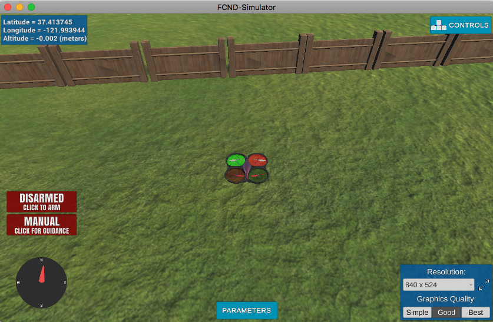

# FCND - Backyard Flyer Project
Backyard Flyer Project for UDACITY Flying Cars ND. 

Make a simulated drone fly in a square shape!   

Initial project to lay basis for the further nanodegree program:
 - Simulator Exploration. Become familiar with the drone simulator used throughout this program as well as UDACITY Drone API (https://udacity.github.io/udacidrone/docs/drone-api.html) and and related protocols
 - Flight Computer Programming. Review the roles of a drone's flight computer and autopilot.
 - Event Driven Programming. Explore the concepts underlying event driven programming by reading and then modifying Python code.
 - Phases of Flight. Learn how the "lifecycle" of a flight plan is represented as a finite state machine.

